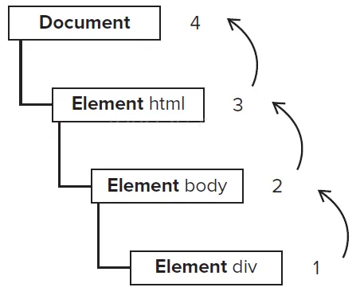
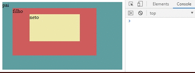

# `Evento Bubbling` (Borbulhamento de eventos)

O **Event Bubbling** ocorre quando um usuário interage com um elemento no HTML e o evento se propaga como “bolhas” por todos os elementos que estão aninhados a ele.

Para explicar esse processo, imagine um copo com refrigerante onde as bolhas borbulham do fundo do copo até o ponto mais alto. O princípio do efeito borbulhando no JavaScript é exatamente o mesmo.

Quando um evento **“bubbling”** é realizado sobre um determinado elemento, todos os ancestrais dele também serão acionados em ordem crescente de aninhamento até chegar ao último elemento:



Para demonstrar esse comportamento as bolhas serão representadas pelos elementos pai, filho e neto:

```
<!DOCTYPE html>
<html>
    <head>
        <meta charset="utf-8">
        <meta name="viewport" content="width=device-width">
        <title>Event Bubbling</title>
    </head>
    
    <body>
        <div id="pai">pai
            <div id="filho">filho
                <div id="neto">neto</div>
            </div>
        </div> 

        <script src="bubble.js"></script>

    </body>
</html>
```

```
const pai     = document.getElementById('pai');
const filho   = document.getElementById('filho');
const neto    = document.getElementById("neto");

pai.addEventListener('click', x=>console.log("pai foi clicado"));
filho.addEventListener('click', x=>console.log("filho foi clicado"));
neto.addEventListener('click', x=>console.log("neto foi clicado"));
```

O efeito de “borbulhamento” se comporta da seguinte forma:

1. Ao clicar no elemento neto, a ação vinculada a ele será disparada e depois os elementos acima dele também serão disparados, no caso do elemento filho e depois do elemento pai.
2. Ao clicar no elemento filho, elemento filho e pai serão disparados, uma vez que existe uma relação de maior proximidade entre eles. O neto não será acionado, pois o efeito irá fazer o elemento selecionado até o ponto mais alto.



Sabe-se então que todos os ancestrais que estão aninhados a ele também conseguirão identificar este evento, além do elemento que foi acionado.

Neste caso um EventListener poderá ser adicionado apenas no elemento pai e ele ficaria com a responsabilidade de identificar qual dos seus filhos foi o alvo da ação.

```
<html>    
<body>
    <div id="pai">pai
        <div id="filho">filho
            <div id="neto">neto</div>
        </div>
    </div> 
    <script>
        const pai = document.getElementById('pai');
        pai.addEventListener('click', x=>console.log(event.target.id), true);
    </script>
</body>
</html>
```

### Mas por que isso acontece?

- É uma forma poderosa de **organizar o código JavaScript** .
- Permite que você **escute eventos em um único elemento** e capture eventos para seus descendentes.
- Imagine, por exemplo, ter um botão “Excluir” dentro de várias linhas de uma tabela. Você poderia adicionar um único `event listener` no elemento da tabela e capturar o clique em qualquer botão "Excluir", sem precisar adicionar um listener em cada botão individualmente.

## Parar a Propagação

No exemplo anterior é possível verificar que o efeito percorre todos os elementos, sempre partindo do item selecionado até o elemento mais alto. Mas, e para interromper esse efeito, como fazer?

Para que isso aconteça, o método `stopPropagation()` deve ser empregado. Ou seja, quando o elemento neto for clicado, será exibida a mensagem no console e o efeito cessará, sendo interrompido, conforme a ilustração abaixo:

```
const pai     = document.getElementById('pai');
const filho   = document.getElementById('filho');
const neto    = document.getElementById("neto");

pai.addEventListener('click', x=>console.log("pai foi clicado"));
filho.addEventListener('click', x=>console.log("filho foi clicado"));
neto.addEventListener('click', x=>{
    console.log("neto foi clicado");
    event.stopPropagation()});
```

### Referência:

- [Evento Bubbling sem JavaScript, por: William Matos Gundim Júnior](https://medium.com/totvsdevelopers/event-bubbling-no-javascript-9d6a8da32854)

### [Voltar ao menu-Dom](../dom.md)


