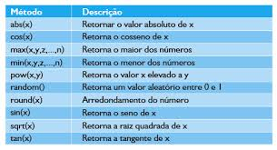

# Objeto `Math`

O objeto `Math`em JavaScript é um objeto embutido (built-in) que **fornece propriedades e métodos matemáticos**.   Ele não é um construtor como outros objetos (por exemplo, , ) e você não precisa criar instâncias dele.   Todas as suas propriedades e métodos são **estáticos**, o que significa que você os acessa diretamente usando a notação ponto (dot notation) com . Array `Object` `Math`

Veja algumas características do objeto `Math`:

- **Propriedades**: Oferece constantes matemáticas como `PI`(valor de pi), (número de Euler) e (logaritmo natural de 2). `E` `LN2`
- **Métodos**: Disponibiliza funções matemáticas comuns como `sin()`, `cos()`, `sqrt()`, `abs()`, `ceil()`, `floor()`, `round()`, entre outras, para realizar cálculos trigonométricos, raízes quadradas, valores absolutos, arredondamentos, e muito mais.    
  - Método `round()`: Converte um número decimal em um número inteiro. Se o valor do número for **abaixo de .5** ele arredonda pra baixo. Se for **acima de .5** ele arredonda pra cima;
  ```
  const number = 8.7
  console.log(Math.round(number))

  // Retorno: 8
  ```  
  - Método `floor()`: Converte um número decimal em inteiro. Sempre arredonda o número pra baixo;
  ```
  const number = 5.3
  console.log(Math.floor(number))

  // Retorno: 5
  ```
  - Método `ceil()`: Converte um número decimal em inteiro. Sempre arredonda pra cima;
  ```
  const number = 5.5
  console.log(Math.ceil(number))

  // Retorno: 6
  ```
  - Método `trunc()`: Converte um decimal em inteiro. Remove a parte decimal;
  ```
  const number = 7.789456
  console.log(Math.trunc(number))

  // Retorno: 7
  ```
  - Método `random()`: Gera um número aleatório entre 0 e 1. 
  ```
  const randomNumber = Math.random()
  console.log(randomNumber())

  Retorno 0.1568751321234
  ```
- **Trabalha com números**: As propriedades e métodos do objeto `Math`são recomendados para funcionar com o tipo de dado `number` em JavaScript.



Resumindo, é uma caixa de ferramentas matemáticas sempre disponível no seu código JavaScript para realizar diversos tipos de cálculos e operações matemáticas. `Math`

#### [Objeto](../objetos.md)